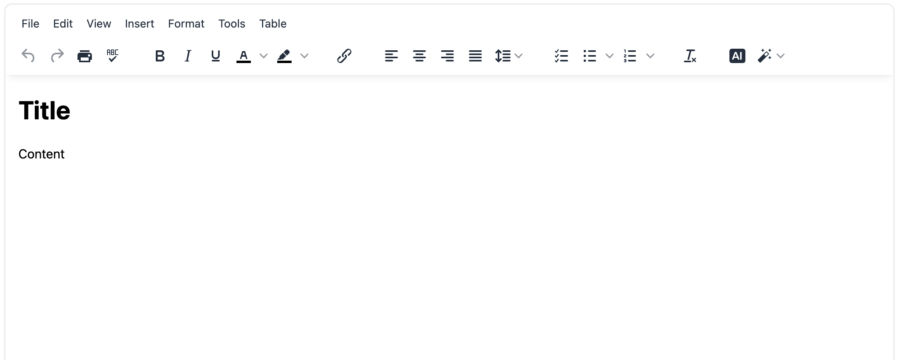
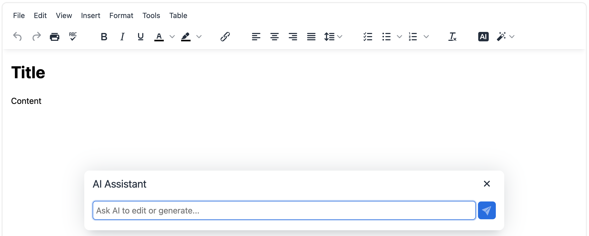
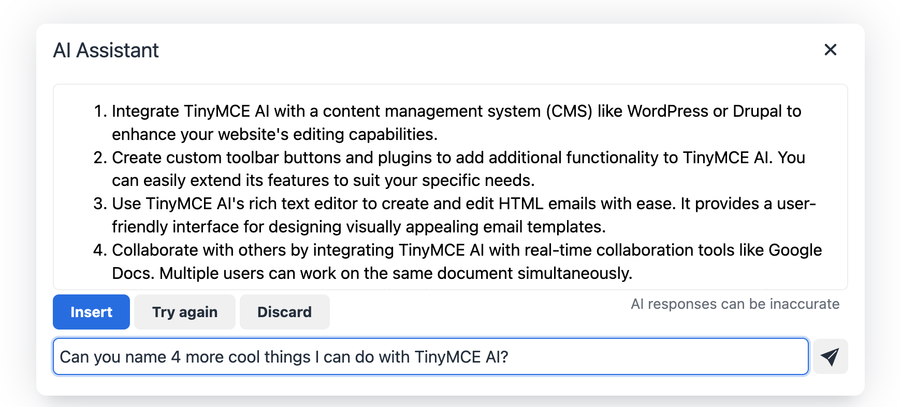
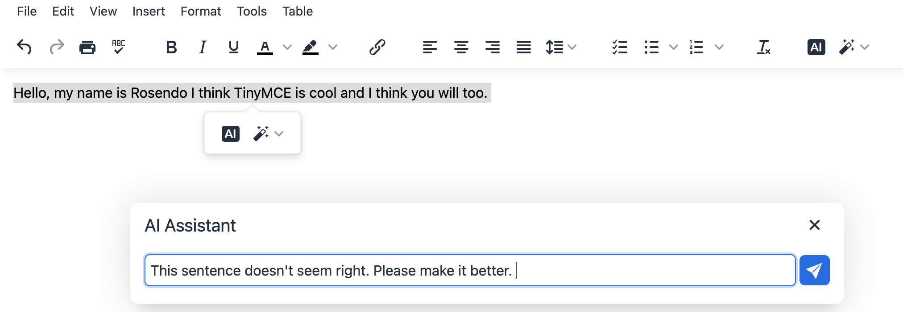
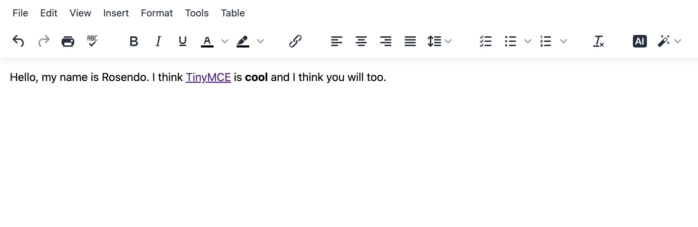

<h2>Build a ChatGPT Powered AI Assistant with TinyMCE in Minutes! </h2>


TinyMCE is a great way to integrate any text-based functionality into an existing application. Today we’re going to learn how to build an AI Assistant using TinyMCE and OpenAI.  \
 \
**<span style="text-decoration:underline;">What to expect: </span>**


* This tutorial should take about 10 minutes to complete! 
* You’ll need to signup for a TinyMCE account at [https://hackp.ac/tinymce](https://hackp.ac/tinymce) 
    * An account is entirely free and you’ll be able to use free premium plugins for 14 days after you sign up! 
* You’ll also need an OpenAI account
    * If you don’t already have an OpenAI account, you can sign up at [https://hackp.ac/openai-signup](https://hackp.ac/openai-signup). Once you input your payment information, you’ll receive $5 worth of free credits to use over the next 3 months. 
* Lastly, you’ll need to have some familiarity with JavaScript and HTML. 

Let’s dig in! 

<h3>Environment Setup</h3>

Open up a text editor of your choice. I’ll be using VSCode and highly suggest you do so as well. 

I’ve also set up a new folder called TinyMCE-OpenAI and inside of that folder I have an **_index.html_** file and a **_script.js_** file.  

Let’s add some HTML into our index.html file: 

```html
<!DOCTYPE html>
<html lang="en">

<head>
  <meta charset="UTF-8">
  <meta name="viewport" content="width=device-width, initial-scale=1.0">
  <title>TinyMCE AI Assistant</title>
  <script src="https://cdn.tiny.cloud/1/{YOUR_TINYMCE_API_KEY}/tinymce/6/tinymce.min.js" referrerpolicy="origin"></script>
  <script src="script.js"></script>
</head>

<body>
    <textarea id="editor">
          <h1>Title</h1>
          <p>Content</p>
    </textarea>
</body>

</html>
```

You’ll notice that we have two script tags inside of the head element. 

The first one features a TinyMCE url that will also require your **TinyMCE API Key**. You can find your API Key in any of the example implementations displayed in your tiny.cloud console when you’re logged into your account! 

<i>Remember: Exposing your API Key is bad practice. You’ll want to set up environmental variables to hide your API Key when you push your code to GitHub.</i>

The second script tag is simply referencing the **script.js** file we set up earlier. Speaking of which, let’s go ahead and add some JavaScript to our application. 

Head over to the **script.js** file and plug in the following code: 

```js
 tinymce.init({
    selector: 'textarea',
    plugins: 'ai advtable powerpaste casechange searchreplace autolink advcode image link codesample table tableofcontents insertdatetime advlist link lists checklist wordcount tinymcespellchecker',
    toolbar: 'undo redo print spellcheckdialog formatpainter | bold italic underline forecolor backcolor | link | alignleft aligncenter alignright alignjustify lineheight | checklist bullist numlist | removeformat | aidialog aishortcuts',
  height: '700px'
  });
```

Right now, we’re initiating a TinyMCE component that will become embedded in the textarea element we have inside of the body of our HTML file. 

We’re also using a ton of different plugins (including the AI plugin) and configuring our toolbar to include several functionalities. If you want to explore TinyMCE plugins on your own, head over to [https://hackp.ac/tinymce-plugins](https://hackp.ac/tinymce-plugins). 

Go ahead and hit the ‘go live’ option in VSCode OR head over to localhost:5500. Your webpage should look something like this: 




All of those TinyMCE plugins and toolbar features are doing a lot under the hood to save you the trouble! 

Now that we’ve got our TinyMCE component set up, we’re going to add some code that allows us to use ChatGPT functionality via OpenAI.

<h4>Understanding ChatGPT parameters</h4>


ChatGPT accepts 4 primary parameters that will dictate how your application generates responses to your prompts. 

Here are the parameters that need to be included with every request. 

**Model** – the specific AI model, (or algorithm) that’s trained to interpret the meaning of data and return a logical response when prompted.

**Prompt** –  the actual request to ChatGPT in a string format.

**Temperature** – this integer indicates how high the random factor in the ChatGPT algorithm should be (a range of 0-2), with lower numbers in the range creating less random and more deterministic responses.

**Max Tokens**– this limits the number of text tokens ChatGPT returns to the person asking the question. There are limits on tokens, so lower numbers can potentially support more questions.

Let’s put some of that new found wisdom to use! Plug in the following code in your **script.js** file. 

```js
height: '700px', 
        ai_request: (request, respondWith) => {
          const openAiOptions = {
            method: 'POST', 
            headers: {
              'Content-Type': 'application/json', 
              'Authorization': `Bearer ${API_KEY}`
            }, 
            body: JSON.stringify(
              {
                model: 'gpt-3.5-turbo', 
                temperature: 0.7, 
                max_tokens: 800, 
                messages: [
                  {
                    role: 'user', 
                    content: request.prompt
                  }
                ]
              }
            )
        };  
     //We'll add more code here in the next step 
        }
    }
);
```

You’ll notice that we have an API_KEY variable that will need to be instantiated at the top of your **script.js** file. Once again, this is simply for demo purposes, and you should use an environment variable to hide this data when you push to production.  \
 \
<i>If you want to learn more about using ‘dotenv’ head over to [https://hackp.ac/dotenv-instructions](https://hackp.ac/dotenv-instructions),</i>

For now, you can instantiate a _const _variable that stores your **API_KEY** value.

```js
const API_KEY = "replace this with your API key" 
//add this variable at the top of your script.js file for now. 
```

With the code that handles our OpenAI request in place, we’ll now need to add a function that handles the response. 

Where we left a placeholder in our **script.js** file, go ahead and plug in the following code.  

```js
  respondWith.string((signal) =>
            window.fetch('https://api.openai.com/v1/chat/completions', {
                signal, 
                ... openAiOptions
            }).then(async(response) => {
                if (response.ok){
                return response.json(); 
                } else {
                    return Promise.reject(`Failed to communicate with the OpenAI API. ${
                    await response.text()
                }`);
                }
            }).then((data)=> data.error ? 
            Promise.reject(`Failed to communicate with ChatGPT API because of ${
                data.error.type
            } error: ${
                data.error.message
            }`) : data).then((data) =>
                data?.choices[0]?.message?.content?.trim()));
```

As you can see from this last bit of code, we’re fetching the ChatGPT response to our request parameters. We’ve also included some error handling that will display error messages if anything goes wrong. 

Let’s launch our application via localhost and check it out. It should look something like this after you click on the **ai icon** in the toolbar: 



If you’ve properly configured your API_KEY and have an OpenAI account with a $5 credit, you’ll be able to ask your AI Assistant pretty much anything! 



Amazing!  

You’ve just built a TinyMCE application with a built-in AI Assistant! 


You can ask it questions or type out some text, highlight it and ask the AI Assistant to make improvements! 



As you can see below, our run-on sentence was corrected and [TinyMCE](https://hackp.ac/tinymce) was hyperlinked to the TinyMCE landing page! 



Congratulations on building your first TinyMCE application! Have fun exploring more of the different functionalities offered by TinyMCE’s functionalities including the [AI plugin](https://hackp.ac/tinymce-plugin-ai) we used to build our AI Assistant. 

Happy hacking! 
